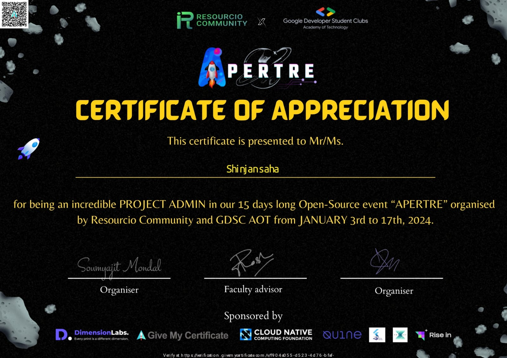

# <div align="center">Canteen-Website </div>

<div align="center">
 <p>

[](https://github.com/ellerbrock/open-source-badges/)


</p>
 </div>

Welcome to the Canteen-Website , where we cater to all your needs.From satisfying main courses to refreshing beverages, essential stationery, printing services, and delightful ice cream treats – we've got it all under one roof.
The College Canteen is not just a place to eat; it's your all-in-one destination for convenience and enjoyment!

## Table of Contents

1. Introduction 📌
2. Technology Used🚀
3. Overview⭐
4. Contribution Guidelines 📑
5. Contributing is fun🧡

## Introduction 📌

Our mission is to cater to your diverse needs, offering not only delicious main courses and refreshing beverages but also essential stationery, hassle-free printing services, and delightful ice cream treats.

Whether you're grabbing a quick bite between classes, restocking your study essentials, or treating yourself to a sweet indulgence, the  Canteen-Website is your all-in-one destination on campus. With the option to order online for swift service or visit our physical location, we strive to make every aspect of your college life more convenient.

## Technology Used🚀

- HTML
- CSS
- JAVASCRIPT
- FLUTTER


## Overview⭐

The  Canteen-Website is a student-centric online platform catering to the diverse needs of college students.

##### Features :

- Explore a variety of main courses, refreshing beverages, essential stationery, convenient printing services, and delightful ice cream treats.
- Enjoy the convenience of placing orders online, ensuring quick and efficient service for your busy academic schedule
- The College Canteen is not just about food. It's a one-stop-shop, providing students with essential stationery and printing services, eliminating the need to visit multiple places.

## Admin of the Project



## Visit the Website Over here

[Click-Here!](https://canteen-website-shinjan.vercel.app/)

## Download the App Over here


[Click-Here!](https://github.com/Shinjan-saha/Canteen-Website/blob/main/canapp/canapp/App-release/app-release.apk)

## Contribution Guidelines 📑

[Click for Rules](https://github.com/Shinjan-saha/Canteen-Website/blob/main/CONTRIBUTE.md)


## Prerequisites

Before you begin, ensure you have met the following requirements:

- [Node.js](https://nodejs.org/) installed
- [Flutter](https://flutter.dev/) installed


## Installation

1. **Clone the repository:**


2. **Navigate to the project folder:**

   ```bash
   cd your-repository
   ```

3. **Install dependencies:**

   ```bash
   npm install
   ```

   ```bash
   flutter pub get
   ```

## Usage

Describe how to run and use your project:

### Running the Web Application

1. **Open the `web` directory:**

   ```bash
   cd web
   ```

2. **Open the `index.html` file in a web browser.**

### Running the Flutter App

1. **Open the `flutter` directory:**

   ```bash
   cd flutter
   ```

2. **Run the app:**

   ```bash
   flutter run
   ```

## Contributing

Describe how others can contribute to your project. Include guidelines for reporting issues, suggesting enhancements, and submitting pull requests.

## License

This project is licensed under the [MIT License](LICENSE).

Copy and paste this content into a markdown file (e.g., `README.md`) in the root of your project. Remember to customize the placeholders like `your-username`, `your-repository`, and any other project-specific information.

## Issues and PRs

If you have suggestions for how this project could be improved, or want to report a bug, open an issue! We'd love all and any contributions. If you have questions, too, we'd love to hear them.

We'd also love PRs. If you're thinking of a large PR, we advise opening up an issue first to talk about it, though! Look at the links below if you're not sure how to open a PR.

## How to Contribute

- Take a look at the Existing [Issues] or create your own!
- Fork the Repo and create a Branch for any Issue that you are working upon.
- Create a Pull Request which will be promptly reviewed and suggestions would be added to improve it.
- Add Screenshots to help us know what this is all about.

## How to make a Pull Request

**1.** Fork the repository by clicking on the Fork symbol at the top right corner.

**2.** Clone the forked repository.

```
   git clone https://github.com/Shinjan-saha/Canteen-Website.git
```

**3.** Navigate to the project directory.

```
   cd Canteen-Website
```

**4.** Create a new branch:

```
   git checkout -b YourBranchName
```

**5.** Make changes in source code.

**6.** Stage your changes and commit

```
   git add .
   git commit -m "<your_commit_message>"
```

**7.** Push your local commits to the remote repo.

```
   git push origin YourBranchName
```

**8.** Create a [PR](https://help.github.com/en/github/collaborating-with-issues-and-pull-requests/creating-a-pull-request)

**Note** If anyone contributes to this repository, then the changes will not be reflected in your local repository. For that:

**9.** Setup a reference(remote) to the original repository to get all the changes from the remote.

```
   git remote add upstream https://github.com/Shinjan-saha/Canteen-Website.git
```

**10.** Check the remotes for this repository.

```
   git remote -v
```

**11.** Fetching from the remote repository will bring in its branches and their respective commits.

```
   git fetch upstream
```

**12.** Make sure that you're on your master branch.

```
   git checkout master
```

**13.** Now that we have fetched the upstream repository, we want to merge its changes into our local branch. This will bring that branch into sync with the upstream, without losing our local changes.

```
   git merge upstream/master
```


